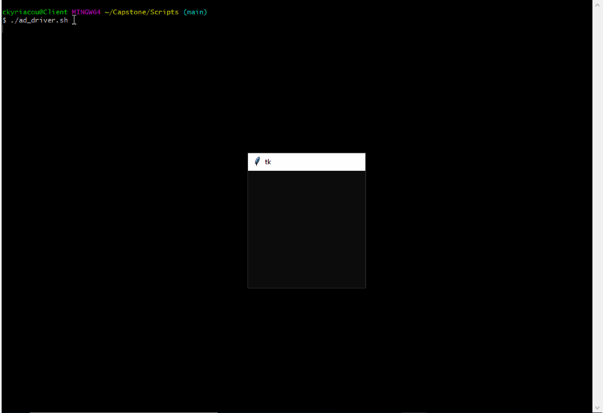

# Capstone
## **[Active Directory](https://docs.microsoft.com/en-us/windows-server/identity/ad-ds/get-started/virtual-dc/active-directory-domain-services-overview) Auditing for Cybersecurity Maturity Model Certification [(CMMC)](https://cybersecurity.att.com/blogs/security-essentials/what-is-cmmc-compliance) Compliance** ##

_________________________________________________________________________________________________________________________________________________________________________________

### **Cybersecurity Maturity Model Certification [(CMMC)](https://cybersecurity.att.com/blogs/security-essentials/what-is-cmmc-compliance):**

***Primary Goal: Safeguard controlled unclassified information (CUI) across the DoD supply chain.***

- CUI: Any information or data created or possessed by the government or another entity on the government’s behalf.
  
***CMMC Levels of compliance:***

CMMC Level 1: Addressing FAR 52.204-21 cybersecurity principles.

CMMC Level 2: Builds on CMMC Level 1 and addresses a little over half of NIST 800-171 controls.

***CMMC Level 3: Builds on CMMC Level 2 and addresses all NIST 800-171 and a few extras. (Our Focus)***

CMMC Levels 4 & 5: Build off CMMC Level 3 and include controls from a range of frameworks:
- CERT RMM v1.2
- NIST SP 800-53
- NIST SP 800-172
- ISO 27002
- CIS CSC 7.1
- Unattributed “CMMC” references that are not attributed to existing frameworks.

For a more in depth look at CMMC and it's levels of certification, visit [CMMC_Research.md](Docs/CMMC_Research.md)
_________________________________________________________________________________________________________________________________________________________________________________

### **Main Goal:**

The goal of this project is to create an auditing system that allows authorized security admin 
to audit their active directory servers for CMMC compliance. This process should be easily automated by being initiated as a task within any automation pipeline
that ARA prefers. A framework for how to create additional audit fuctionality with pyad will be constructed as well.

***Base functionality list to reach our main goal:***
1. Use AD to identify computers, verify that the computer has a distinct name, the name follows the convention, and it requires the user to log in.
2. List the users and computers in AD who have not logged in in N days.
3. Produce a list of users who have not changed their password in N days.
4. Produce a list of users in a given AD section (i.e., restrict.xxx.com) who have administrative privileges
5. For service accounts, ensure that the “manager” field is filled out.  A question is how to identify service accounts.  There is a naming convention, but we do not know if it is followed (another audit requirement).
6. For all accounts, the “password expire” flag is set.  More specifically, which accounts do not have this set?
7. Write a script that uses Windows Sysinternals tool(s) on a remote system to monitor for what process is communicating with a given IP and/or port.  As much detail about the process as can be found should be reported.  Install sysinternals on the remote computer if needed.  Using psexec is OK.  This is probably the top priority.

Link to updated status of functionality: [Updated Functionality/Progress](Scripts/Prototype_Status.md)
_________________________________________________________________________________________________________________________________________________________________________________

### **Audit Process (Proposed End-Goal)**

1. Automation environment of choice initiates a bash script to pass credentials and variables, requried by the procedural Python script, then executes the Python script.
2. Domain Admin User establishes connection with an Active Directory Domain Controller.(Must be on end-unit that is joined with the Active Directory Server Domain of interest)
3. The Python script attempts to retrieve all information requested using the customized class that utilizes the [pyad 0.6.0 package](https://pypi.org/project/pyad/).
4. If the audit succeeds, it will be indicated if the Domain(s) are compliant or not. If it is unsuccessful because of an error, a restart will be triggered up to 3 times before indicating a ticket for an Admin to take a look into the error. 

________________________________________________________________________________________________________________________________________________________________________________
### **Schedule** ###

________________________________________________________________________________________________________________________________________________________________________________
### **Classes** ###

1. [ADaudit.py](Scripts/ADaudit.py): This class utilizes the [pyad 0.6.0 package](https://pypi.org/project/pyad/) package to audit and/or remediate an Active Directory instance for the incompliances meantioned in the functionality list above. For generating an audit report, [pandas 1.2.3](https://pandas.pydata.org/) is utilize to display all contents in a dataframe and/or in .csv format.
2. [Port_Scanner.py](Scripts/Port_Scanner.py): This class utilizes [socket](https://docs.python.org/3/library/socket.html) and [threading](https://docs.python.org/3/library/threading.html) to discover what processes are running on a socket level on an Active Directory instance, and [pypsexec 0.2.0](https://pypi.org/project/pypsexec/) to execute commands on an Active Directory instance's command prompt from a remote host.
3. [report_gen.py](Scripts/report_gen.py): This class utilizes [pandas 1.2.3](https://pandas.pydata.org/), [mdutils 1.3.0](https://pypi.org/project/mdutils/), and [reportlab 3.5.62](https://pypi.org/project/reportlab/) to clean and output results as either a markdown file or a PDF.

________________________________________________________________________________________________________________________________________________________________________________

### **Mock Setup for Prototype/Proof of Concept**

***- Used a system of virtual machines orchestrated in Oracle VirtualBox***
1. Created both a Windows Enterprise Server 2019 and Windows 10 Pro instance.
2. Once both instances were up and running, The Windows 10 Pro instance was used to join the Active Directory Domain (A .local Domain was used for this prototype).
3. Within the Windows 10 Pro instance, the [ADaudit.py](Scripts/ADaudit.py) class, the [Port_Scanner.py](Scripts/Port_Scanner.py) class, the [Active_Directory_Audit.py](Scripts/Active_Directory_Audit.py) procedural script, and the [Active_Directory_Remediate.py](Scripts/Active_Directory_Remediate.py) procedural script was used to test the ability to audit Active Directory Servers with the [pyad 0.6.0 package](https://pypi.org/project/pyad/). The [Port_Scanner.py](Scripts/Port_Scanner.py) class was specifically used to test the ability to run port scans on the socket level using [socket](https://docs.python.org/3/library/socket.html) and [threading](https://docs.python.org/3/library/threading.html). It was also used to run [netstat](https://docs.microsoft.com/en-us/windows-server/administration/windows-commands/netstat) -ban and [netstat](https://docs.microsoft.com/en-us/windows-server/administration/windows-commands/netstat) -an to with [pypsexec 0.2.0](https://pypi.org/project/pypsexec/) on the Active Directory Server from a remote host.
4. All the results of each audit type were designed to be stored in a markdown file named [Audit_Report.md](Scripts/Audit_Report.md) for future use by the Domain Admin.
5. The results of the port scan of all active computers, connect to the domain controller, at the socket level are in [Port_Details.md](Scripts/Port_Details.md), and the output of the netstat commands executed on the server are in [Command_Output.md](Scripts/Command_Output.md).
_________________________________________________________________________________________________________________________________________________________________________________

### ***Installation Instructions*** ###

1. Prior to installation:
   - Ensure that you use Windows 7, 8 or 10 installed
   - The domain controller of interest is a Windows Server instance.
   - Ensure that your Windows Server instance has netstat capabilities.
   - You have a minimum of python 3 installed on your windows instance.
   - Ensure that you have installed the [pandas](https://pandas.pydata.org/) and [NumPy](https://numpy.org/) packages installed as a starting point.
   - Look at all packages imported into the implementation scripts described in the previous section (other than the classes being exported from this github repository), and make sure that all package requirements are met.
   - Install git bash on you windows instance if you are planning to use bash files to pass os variables.
   - You have access to an admin account joined to the domain controller of interest. All installation should be done on the account with admin privileges.
   * It is recommended that you use an IDE that supports python and bash scripts. Use either pip or pip3 to install necessary packages.
2. Once the previous step is satisfied, Follow the installation instructions on the [pyad](https://pypi.org/project/pyad/) PyPi documentation.
3. Once the latest version of pyad is installed, test the connection to your server by:
   - Opening a new python script
   - importing pyad as shown: from pyad import *
   - Writing a line to access a user from their common name as shown (It's recommended you use your admin CN): user = aduser.ADUser.from_cn("your common name")
   - Write a line to print the user as shown: print(user)
   * It is imperative that this step is successful before moving forward.
4. Follow the installation instructions on the [pypsexec 0.2.0](https://pypi.org/project/pypsexec/) PyPi documentation.
   - Note, the instructions indicate Windows blocks the SMB port 445 by default, but the prototype described previously was able to use psexec without physically opening the port. If your domain controller does do a strict block of SMB port 445, there are instructions on how to open this port in the documentation stated above.
5. In the Scripts section, locate the [ADaudit.py](Scripts/ADaudit.py), [Port_Scanner.py](Scripts/Port_Scanner.py), [Active_Directory_Audit.py](Scripts/Active_Directory_Audit.py), [Active_Directory_Remediate.py](Scripts/Active_Directory_Remediate.py), and the [report_gen.py](Scripts/report_gen.py) and export them from github and then import them into you ide or python environment of choice. 
   - Make sure they are all within the same folder. 
6. If you are planning to use bash files to import os variables, look through the [Active_Directory_Audit.py](Scripts/Active_Directory_Audit.py) and use it as a guide to locate distinguished names that identify the appropriate location of desired user, computer and service account folders. Also ensure pass the common name of the admin accessing the information as well as the names of the appropriate txt files to be generated into md and pdf files. files that will be generated based on your preferences.
7. Use the [bash_script_example_audit.txt](Scripts/bash_script_example_audit.txt) and the [bash_script_example_remediate.txt](Scripts/bash_script_example_remediate.txt) as templates to make bash scripts for passing information to the [Active_Directory_Audit.py](Scripts/Active_Directory_Audit.py) and [Active_Directory_Remediate.py](Scripts/Active_Directory_Remediate.py) procedural scripts.
8. If you decide to pass in the infomation from the script, you will need to change the methods that import the os variable to the bash script to the actual values of the variables or have them pull from another specified area.
9. Once you have ensured all passed information is accurate, make your bash script(s) executable by using chmod +x name_of_bash_script.
10. Now you should be ready to execute.

### Note: At this time, we are still in the prototyping phase, so there may be changes made frequently. ###
_________________________________________________________________________________________________________________________________________________________________________________

### ***Executable Prototype*** ###

#### ***Active Directory Audit and Netstat scan*** ####

- This prototype displays a full Active Directory audit and a series of netstat commands that are being executed on the Active Directory Server from a remote host.

#### Active Directory Audit and Remediation ####

- This prototype displays a full Active Directory audit and remediation.

_________________________________________________________________________________________________________________________________________________________________________________

# Capstone Team Members #

## Roles ##
### - Team Leader | Lead Software Developer: Chris Kyriacou ###
### - Deputy Team Leader: Safeeullah Ghafoori ###
### - Documentation Specialist: Nathan Chong ###
### - Researcher(s): Jamie Sutton, Dave Fuller ###

________________________________________________________________________________________________________________________________________________________________________________

## Special Thank You To: ##

### - Chris Prather ([Applied Research Associates, Inc.](https://www.ara.com/)) ###

### - Dr. Kenneth Ingham ([Applied Research Associates, Inc.](https://www.ara.com/)) ###

### - Prof. John McLaughlin ([George Mason University](https://www2.gmu.edu/)) ###
