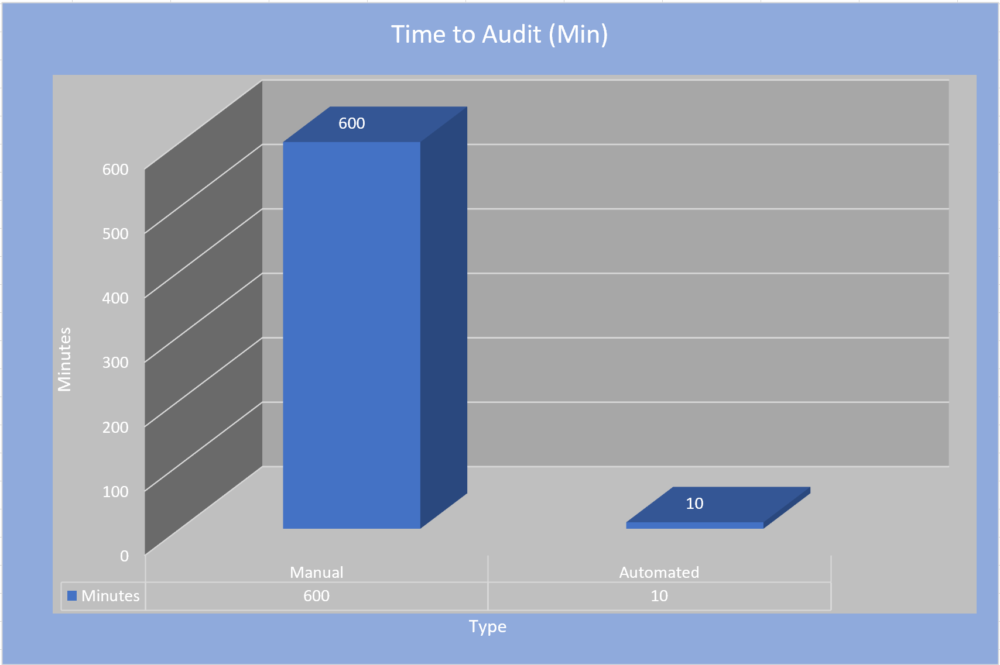
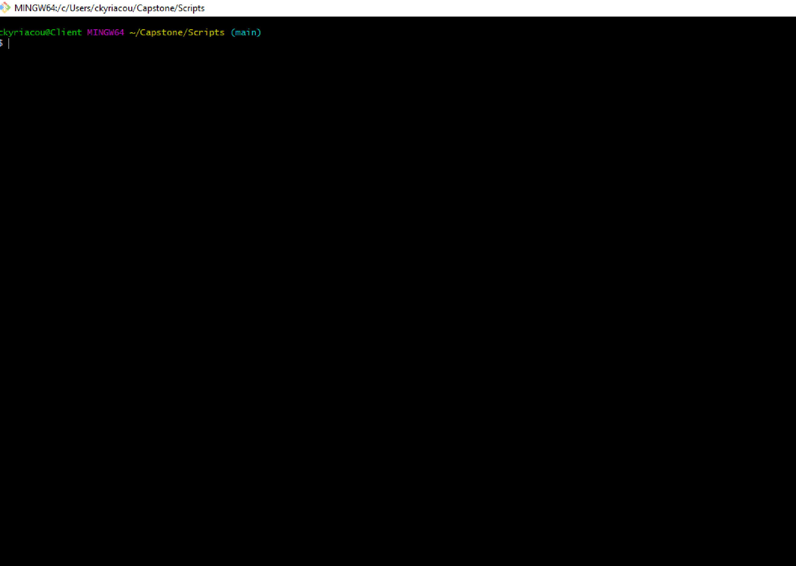

# Capstone
## **[Active Directory](https://docs.microsoft.com/en-us/windows-server/identity/ad-ds/get-started/virtual-dc/active-directory-domain-services-overview) Auditing for Cybersecurity Maturity Model Certification [(CMMC)](https://cybersecurity.att.com/blogs/security-essentials/what-is-cmmc-compliance) Compliance** ##

_________________________________________________________________________________________________________________________________________________________________________________

### **Cybersecurity Maturity Model Certification [(CMMC)](https://cybersecurity.att.com/blogs/security-essentials/what-is-cmmc-compliance):**

***Primary Goal: Safeguard controlled unclassified information (CUI) across the DoD supply chain.***

- CUI: Any information or data created or possessed by the government or another entity on the government’s behalf.
  
***CMMC Levels of compliance:***

CMMC Level 1: Addressing FAR 52.204-21 cybersecurity principles.

CMMC Level 2: Builds on CMMC Level 1 and addresses a little over half of NIST 800-171 controls.

***CMMC Level 3: Builds on CMMC Level 2 and addresses all NIST 800-171 and a few extras. (Our Focus)***

CMMC Levels 4 & 5: Build off CMMC Level 3 and include controls from a range of frameworks:
- CERT RMM v1.2
- NIST SP 800-53
- NIST SP 800-172
- ISO 27002
- CIS CSC 7.1
- Unattributed “CMMC” references that are not attributed to existing frameworks.

For a more in depth look at CMMC and it's levels of certification, visit [CMMC_Research.md](Docs/Certification_Research/CMMC_Research.md)
_________________________________________________________________________________________________________________________________________________________________________________

### **Main Goal:** ###

The goal of this project is to create an auditing system that allows authorized security admin 
to audit their Active Directory servers for CMMC compliance daily. This process should be easily automated by being initiated as a task within any automation pipeline
that ARA prefers. A framework for how to create additional audit fuctionality with pyad will be constructed as well.

***Case for change:***

1. The client's current system is CMMC Stage 2 compliant and auditing/remediation are conducted manually.
2. Current auditing takes 2 or more days and remediation takes a variable amount of time.
3. Our solution will make it possible to audit (and remediate if requested) in minutes on thousands of employee accounts.
4. Our solution will save overhead hours and reduce the cost needed for auditing (from days of work monthly to minutes of work daily for auditing).
5. The client's system will be CMMC Stage 3 compliant once a successful implementation is achieved. 

***Time to Audit (Estimated)***



***Base functionality list to reach our main goal:***
1. Use AD to identify computers, verify that the computer has a distinct name, the name follows the convention, and it requires the user to log in.
2. List the users and computers in AD who have not logged in in N days.
3. Produce a list of users who have not changed their password in N days.
4. Produce a list of users in a given AD section (i.e., restrict.xxx.com) who have administrative privileges.
5. For service accounts, ensure that the “manager” field is filled out.  A question is how to identify service accounts.  There is a naming convention, but we do not know if it is followed (another audit requirement).
6. For all accounts, the “password expire” flag is set.  More specifically, which accounts do not have this set?
7. Write a script that uses Windows Sysinternals tool(s) on a remote system to monitor for what process is communicating with a given IP and/or port.  As much detail about the process as can be found should be reported.  Install sysinternals on the remote computer if needed.  Using psexec is OK.  This is probably the top priority.

Link to updated status of functionality: [Updated Functionality/Progress](Scripts/Prototype_Status.md)
_________________________________________________________________________________________________________________________________________________________________________________

### **Audit Process (Proposed End-Goal)** ###

1. Automation environment of choice initiates a bash script to pass credentials and variables, requried by the procedural Python script, then executes the Python script.
2. Domain Admin User establishes connection with an Active Directory Domain Controller.(Must be on end-unit that is joined with the Active Directory Server Domain of interest)
3. The Python script attempts to retrieve all information requested using the customized class that utilizes the [pyad 0.6.0 package](https://pypi.org/project/pyad/).
4. If the audit succeeds, it will be indicated if the domain(s) are compliant or not. If it is unsuccessful because of an error, a restart will be triggered up to 3 times before indicating a ticket for an admin to take a look into the error.              

***Audit Process Diagram***


________________________________________________________________________________________________________________________________________________________________________________
### **Schedule** ###


________________________________________________________________________________________________________________________________________________________________________________
### **Classes** ###

1. [ADaudit.py](Scripts/ADaudit.py): This class utilizes the [pyad 0.6.0 package](https://pypi.org/project/pyad/) package to audit and/or remediate an Active Directory instance for the incompliances mentioned in the functionality list above. For generating an audit report, [pandas 1.2.3](https://pandas.pydata.org/) is utilize to display all contents in a dataframe and/or in .csv format.
2. [Port_Scanner.py](Scripts/Port_Scanner.py): This class utilizes [socket](https://docs.python.org/3/library/socket.html) and [threading](https://docs.python.org/3/library/threading.html) to discover what processes are running on a socket level on an Active Directory instance, and [pypsexec 0.2.0](https://pypi.org/project/pypsexec/) to execute commands on an Active Directory instance's command prompt from a remote host.
3. [report_gen.py](Scripts/report_gen.py): This class utilizes [pandas 1.2.3](https://pandas.pydata.org/), [mdutils 1.3.0](https://pypi.org/project/mdutils/), and [reportlab 3.5.62](https://pypi.org/project/reportlab/) to clean and output results as either a markdown file or a PDF.

________________________________________________________________________________________________________________________________________________________________________________


### **Mock Setup for Prototype/Proof of Concept** ###


***- Used a system of virtual machines orchestrated in Oracle VirtualBox***
1. Created both a Windows Enterprise Server 2019 and Windows 10 Pro instance.
2. Once both instances were up and running, The Windows 10 Pro instance was used to join the Active Directory Domain (A .local Domain was used for this prototype).
3. Within the Windows 10 Pro instance, the [ADaudit.py](Scripts/ADaudit.py) class, the [Port_Scanner.py](Scripts/Port_Scanner.py) class, the [Active_Directory_Audit.py](Scripts/Active_Directory_Audit.py) procedural script, and the [Active_Directory_Remediate.py](Scripts/Active_Directory_Remediate.py) procedural script was used to test the ability to audit Active Directory Servers with the [pyad 0.6.0 package](https://pypi.org/project/pyad/). The [Port_Scanner.py](Scripts/Port_Scanner.py) class was specifically used to test the ability to run port scans on the socket level using [socket](https://docs.python.org/3/library/socket.html) and [threading](https://docs.python.org/3/library/threading.html). It was also used to run [netstat](https://docs.microsoft.com/en-us/windows-server/administration/windows-commands/netstat) -ban and [netstat](https://docs.microsoft.com/en-us/windows-server/administration/windows-commands/netstat) -an to with [pypsexec 0.2.0](https://pypi.org/project/pypsexec/) on the Active Directory Server from a remote host.
4. All the results of each audit type were designed to be stored in a markdown file named [Audit_Report.md](Scripts/Audit_Report.md) for future use by the Domain Admin.
5. The results of the port scan of all active computers, connect to the domain controller, at the socket level are in [Port_Details.md](Scripts/Port_Details.md), and the output of the netstat commands executed on the server are in [Command_Output.md](Scripts/Command_Output.md).
_________________________________________________________________________________________________________________________________________________________________________________

### ***Installation Instructions*** ###

1. Prior to installation:
   - Ensure that you have a working installation of Windows 7, 8 or 10.
   - Ensure that the domain controller of interest is a Windows Server instance.
   - Ensure that your Windows Server instance has netstat capabilities.
   - Ensure that you have a minimum of Python 3 installed on your Windows instance.
   - Ensure that you have installed the [pandas](https://pandas.pydata.org/) and [NumPy](https://numpy.org/) packages as a starting point.
   - Look at all packages imported into the implementation scripts described in the previous section (other than the classes being exported from this github repository), and make sure that all package requirements are met.
   - Install git bash on your Windows instance if you are planning to use bash files to pass os variables.
   - You have access to an admin account joined to the domain controller of interest. All installation should be done on the account with admin privileges.
   * It is recommended that you use an IDE that supports python and bash scripts. Use either pip or pip3 to install necessary packages.
2. Once the previous step is satisfied, follow the installation instructions on the [pyad](https://pypi.org/project/pyad/) PyPi documentation.
3. Once the latest version of pyad is installed, test the connection to your server by:
   - Opening a new python script
   - Importing pyad as shown: ``` from pyad import *```
   - Writing a line to access a user from their common name as shown (It's recommended you use your admin CN: ```user = aduser.ADUser.from_cn("your common name")```
   - Write a line to print the user as shown: ```print(user)```
   * **_It is imperative that this step is successful before moving forward._**
4. Follow the installation instructions on the [pypsexec 0.2.0](https://pypi.org/project/pypsexec/) PyPi documentation.
   - Note: The instructions indicate Windows blocks the SMB port 445 by default, but the prototype described previously was able to use psexec without physically opening the port. If your domain controller does do a strict block of SMB port 445, there are instructions on how to open this port in the documentation stated above.
5. In the Scripts section, locate the [ADaudit.py](Scripts/ADaudit.py), [Port_Scanner.py](Scripts/Port_Scanner.py), [Active_Directory_Audit.py](Scripts/Active_Directory_Audit.py), [Active_Directory_Remediate.py](Scripts/Active_Directory_Remediate.py), and the [report_gen.py](Scripts/report_gen.py) and export them from github and then import them into you ide or python environment of choice. 
   - Make sure they are all within the same folder. 
6. If you are planning to use bash files to import os variables, look through the [Active_Directory_Audit.py](Scripts/Active_Directory_Audit.py) and use it as a guide to locate distinguished names that identify the appropriate location of desired user, computer and service account folders. Also ensure pass the common name of the admin accessing the information as well as the names of the appropriate txt files to be generated into md and pdf files. files that will be generated based on your preferences.
7. Use the [bash_script_example_audit.txt](Scripts/bash_script_example_audit.txt) and the [bash_script_example_remediate.txt](Scripts/bash_script_example_remediate.txt) as templates to make bash scripts for passing information to the [Active_Directory_Audit.py](Scripts/Active_Directory_Audit.py) and [Active_Directory_Remediate.py](Scripts/Active_Directory_Remediate.py) procedural scripts.
8. If you decide to pass in the infomation from the script, you will need to change the methods that import the os variable to the bash script to the actual values of the variables or have them pull from another specified area.
9. Once you have ensured all passed information is accurate, make your bash script(s) executable by using     ```chmod +x name_of_bash_script```.
10. Now you should be ready to execute.

### Optional Encryption for bash file with location paths/dn and credentials for Active Directory (Need Git Bash for this step): ###
***Installation:***
1. Install make by following the instructions provided by the [gitBash_Windows](https://gist.github.com/evanwill/0207876c3243bbb6863e65ec5dc3f058) documentation under the section named "make".
2. Once the make zip file is extracted properly to your git bash instance, create a file called Makefile in the folder you have your scripts in. ***Note: The name must be Makefile.***
3. Add the following to your Makefile script to properly make use of GNU Privacy Guard (Free RFC 4880 spec OpenPGP equivalent (AES.CFB Symmetric Encryption 128 bit with 256 bit key):

****If you are just using the audit script:****

encrypt:
    
    encrypt:
            gpg -c filename.sh
            rm filename.sh

decrypt:
    
    decrypt:
            gpg --output filename.sh -d filename.sh.gpg 

remove:
    
    remove:
           rm filename.sh
    
****If you also want to use remediation:****

encrypt_audit:

    encrypt_audit:
                  gpg -c filename.sh
                  rm filename.sh

decrypt_audit:
    
    decrypt_audit:
                  gpg --output filename.sh -d filename.sh.gpg 

remove_audit:
    
    remove_audit:
                 rm filename.sh

encrypt_remediate:
    
    encrypt_remediate:
                      gpg -c filename.sh
                      rm filename.sh

decrypt_remediate:
    
    decrypt_remediate:
                      gpg --output filename.sh -d filename.sh.gpg 

remove_remediate:
    
    remove_remediate:
                     rm filename.sh
  
4. Once you have your makefile set up, call each of the above functions by simply typing the following: ```make functionName```
    - Example: ```make encrypt```
    - This will encrypt your file using pgp which will prompt you for a password for the file and then delete the plaintext file.

***Recommended Usage of Makefile***

1. Navigate to the folder where your scripts and Makefile is located
2. Execute the command: ```make encrypt``` (only if you are using an audit script) or ```make encrypt_audit```/```make encrypt_remediate``` if you have a remediation script as well.
    - This will create an encrypted gpg file named after your file, that is password protected, and remove the unencrypted bash file.
    - The password acts as a secret key, and if you were to send this gpg file to someone else, the only way to decrypt it is with that secret key.
3. Whenever an authorized admin wants to execute an audit or remediation, they simply need to execute ```make decrypt``` or ```make decrypt_audit``` and ```make decrypt_remediate```, execute the decrypted script as follows: ```./filename.sh``` and execute ```make remove``` or ```make remove_audit``` and ```make remove_remediate```.          
4. Repeat step 3 whenever you would like to execute the script.    

***Visual Example***



### Note: At this time, we are still in the prototyping phase, so there may be changes made frequently. ###
_________________________________________________________________________________________________________________________________________________________________________________

### ***Executable Prototype*** ###


#### ***Active Directory Audit and Netstat scan*** ####


- This prototype displays a full Active Directory audit and a series of netstat commands that are being executed on the Active Directory Server from a remote host.

#### ***Active Directory Audit and Remediation*** ####


- This prototype displays a full Active Directory audit and remediation.

________________________________________________________________________________________________________________________________________________________________________________

### ***Example Output*** ###

- For a markdown version of the output of an active directory audit using [ADaudit.py](Scripts/ADaudit.py), look at [Audit_Report.md](Scripts/Audit_Report.md).
- For a markdown version of the output of an active directory audit using [Port_Scanner.py](Scripts/Port_Scanner.py), look at [Netsat-ban.md](Scripts/Netstat-ban.md), [Netstat-an](Scripts/Netstat-an.md) and [Port_Details.md](Scripts/Port_Details.md).
________________________________________________________________________________________________________________________________________________________________________________

### ***Maintenance*** ###

***Note: These are only suggested practices. Steps may vary depending on your system setup***

1. Prior to use, ensure that all software being used to run the audit, as well as any software that may adversely affect the security of the host running the audit, are up to date.
2. Check to see that your version of Python is at it's latest version. Depreciated versions of coding languages may have unwanted vulnerabilities.
3. If your Python version is out of date, update it to the latest version. Otherwise, you are finished and you don't need to continue to the following steps.
4. Once the newest version of Python is installed, verify that all packages being used are up to date as well. There are rare cases where a pip re-installation may be necessary using the newest pip version (pip3, pip4, etc.).
5. Read through the documentation of the newest Python version and the newest version of all packages being used to familiarize yourself with any changes to the package.
6. Walk through all the required code to ensure that all depreciated syntax usage, method calls, and package imports are all corrected to be run using the latest Python version.
7. Once you've made corrections, try running the script and repeat step 6 as many times as necessary until the code functions properly. If any unforeseen errors are still occuring, re-visit the Python library of the Python version and/or package to help resolve any issue(s) and/or reach out to the package maintainers for assistance (Generally can be done through their Github page, personal website, etc.).

________________________________________________________________________________________________________________________________________________________________________________

### ***Next Steps*** ###

#### Continued Maintenance ####
* In terms of operations and maintenance, ARA will be at CMMC Level 3, and they may consider qualifying for CMMC Level 4.                                                              
* Certain security measures associated with higher levels of compliance (such as regularly logging out users/forcing passord changes) may break/interrupt business operations but ensures that any adversaries that are logged in to the system are logged out.                                            
* Consider what other systems would benefit from automation and to degree (semi automatic or automatic operation).                                            
* Consider what other aspects of ARA's systems need remediation.                                                           

#### Auditing and remediation for CMMC Levels 4 and 5 ####

________________________________________________________________________________________________________________________________________________________________________________
# Capstone Team Members #


## Roles ##
### - Team Leader | Lead Software Developer: Chris Kyriacou ###
### - Deputy Team Leader: Safeeullah Ghafoori ###
### - Documentation Specialist: Nathan Chong ###
### - Researcher(s): Jamie Sutton, Dave Fuller ###

________________________________________________________________________________________________________________________________________________________________________________
# Meeting Documentation 

|Date|Purpose|Attendees|Agenda|Actions|Next Meetings| 
| :---: | :---: | :---: | :---: | :---: | :---: |
|01/07|**ARA Meeting 1**|Alpha Team 4, Dr. Ingham, Chris Prather|Discussed change in capstone project to Active Directory CMMC compliance|Research Powershell and AD, utilizing Python with Pyad and how it can navigate with AD|01/12 (Team), 01/21 (ARA)|
|01/12|Team Meeting 1|Alpha Team 4|Discussed research on CMMC, AD and auditing using python|Continue performing research|01/19|
|01/19|Team Meeting 2|Alpha Team 4|Continued discussion on research on CMMC, AD and auditing using python|Continue performing research, prepare for next ARA meeting|01/21|
|01/21|**ARA Meeting 2**|Alpha Team 4, Dr. Ingham, Chris Prather|Discussion on project solution requirements|Research into psExec Library, as well as documentation styles|01/22 (Team), 02/04 (ARA)|
|01/22|Team Meeting 3 (Coding session)|Alpha Team 4|Work on coding and initial documentation as a group|Rundown of current code in progress, created and uploaded initial code documentation on GitHub|01/26|
|01/26|Team Meeting 4|Alpha Team 4| | |02/02|
|02/02|Team Meeting 5|Alpha Team 4|Continue working on code, discuss weekly task assignments|Discussion of progress of code and documentation, converting personal documentation into Markdown format|02/04 (ARA)|
|02/04|**ARA Meeting 3**|Alpha Team 4, Dr. Ingham|Discussion on progress of project|clarified project requirements and concerns|02/09 (Team), 02/18 (ARA)|
|02/09|Team Meeting 6|Alpha Team 4|Continued discussion on code and research into AD vulnerabilities|Continue performing research and complete weekly task|01/19|
|02/16|Team Meeting 7|Alpha Team 4|Discussion on progress of project and weekly task|Work on blockchain paper assignment|02/18 (ARA), 02/23 (Team)|
|02/18|**ARA Meeting 4**|Alpha Team 4, Dr. Ingham|Discussion on progress of project|Discussion of progress of scripts, discussion on how ARA currently performs remediation|02/23 (Team), 03/18 (ARA)|
|02/23|Team Meeting 8|Alpha Team 4|Discussion on progress of code, and weekly task|Discussed how to format documentation of code to meet ARA standards, worked on changed business process presentation|03/02 (Team)|
|03/02|Team Meeting 9|Alpha Team 4|Discussion on progress of project| |03/04|
|03/04|Team Meeting 10|Safee, Nathan, Chris|High-level overview of scripts|Discussion of how script works and requirements, worked on documentation|03/09 (Team)|
|03/09|Team Meeting 11|Alpha Team 4|Discussion on progress of project|Waiting on rescheduled meeting with ARA, discussed quantification of solution, work on IT Solution presentation|03/16 (Team)|
|03/16|Team Meeting 12|Alpha Team 4|Discussion on progress of project|Discussion of progress of scripts, discussion on how ARA currently performs remediation, work on quantum computing presentation|03/18 (ARA), 03/30 (Team)|
|03/18|**ARA Meeting 5**|Alpha Team 4, Dr. Ingham|Discussion on progress of project|discussed Dr. Ingham's progress in implementing script on his laptop, worked on further documentation|03/30 (Team), 04/01 (ARA)|
|03/30|Team Meeting 13|Alpha Team 4|Discussion on progress of project|Discussed encryption and decryption process for script, discussed solution sustainment and next steps for solution|04/01 (ARA), 04/06 (Team)|
|04/01|**ARA Meeting 6**|Alpha Team 4, Dr. Ingham|Discussion on progress of project|Discussion of progress of scripts, discussion on how ARA currently performs remediation|03/18 (ARA), 03/30 (Team)|
|04/06|Team Meeting 14|Alpha Team 4|Practice dry run|performed a practice dry run, took notes on areas needing improvement, worked on quantification analysis and testing/)&M plan assignments|04/16 (ARA), 03/30 (Team)|
|04/16|**ARA Meeting 7**|Alpha Team 4, Dr. Ingham|Discussion on progress of project|discussed Dr. Ingham's progress in implementing our script, troubleshooting AD issues|04/20 (Team), 04/29 (ARA)|
|04/20|Team Meeting 15|Chris, Dave, Jamie, Nathan|Practice dry run|performed a practice dry run, took notes on areas needing improvement|04/27 (Team), 04/29 (ARA)|
|04/27|Team Meeting 16|Alpha Team 4|Final meeting before presentation|touched base on final presentation and project notebook requirements|04/29 (ARA)|
________________________________________________________________________________________________________________________________________________________________________________
## Special Thank You To: ##

### - Chris Prather ([Applied Research Associates, Inc.](https://www.ara.com/)) ###

### - Dr. Kenneth Ingham ([Applied Research Associates, Inc.](https://www.ara.com/)) ###

### - Prof. John McLaughlin ([George Mason University](https://www2.gmu.edu/)) ###
