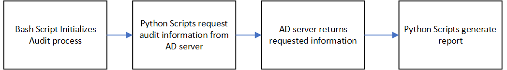

# Capstone
## **[Active Directory](https://docs.microsoft.com/en-us/windows-server/identity/ad-ds/get-started/virtual-dc/active-directory-domain-services-overview) Auditing for Cybersecurity Maturity Model Certification [(CMMC)](https://cybersecurity.att.com/blogs/security-essentials/what-is-cmmc-compliance) Compliance** ##

_________________________________________________________________________________________________________________________________________________________________________________

### **Cybersecurity Maturity Model Certification [(CMMC)](https://cybersecurity.att.com/blogs/security-essentials/what-is-cmmc-compliance):**

***Primary Goal: Safeguard controlled unclassified information (CUI) across the DoD supply chain.***

- CUI: Any information or data created or possessed by the government or another entity on the government’s behalf.
  
***CMMC Levels of compliance:***

CMMC Level 1: Addressing FAR 52.204-21 cybersecurity principles.

CMMC Level 2: Builds on CMMC Level 1 and addresses a little over half of NIST 800-171 controls.

***CMMC Level 3: Builds on CMMC Level 2 and addresses all NIST 800-171 and a few extras. (Our Focus)***

CMMC Levels 4 & 5: Build off CMMC Level 3 and include controls from a range of frameworks:
- CERT RMM v1.2
- NIST SP 800-53
- NIST SP 800-172
- ISO 27002
- CIS CSC 7.1
- Unattributed “CMMC” references that are not attributed to existing frameworks.

For a more in depth look at CMMC and it's levels of certification, visit [CMMC_Research.md](Docs/CMMC_Research.md)
_________________________________________________________________________________________________________________________________________________________________________________

### **Main Goal:**

The goal of this project is to create an auditing system that allows authorized security admin 
to audit their active directory servers for CMMC compliance. This process should be easily automated by being initiated as a task within any automation pipeline
that ARA prefers. A framework for how to create additional audit fuctionality with pyad will be constructed as well.

***Functionality list to reach our main goal:***
1. Use AD to identify computers, verify that the computer has a distinct name, the name follows the convention, and it requires the user to log in.
2. List the users and computers in AD who have not logged in in N days.
3. Produce a list of users who have not changed their password in N days.
4. Produce a list of users in a given AD section (i.e., restrict.xxx.com) who have administrative privileges
5. For service accounts, ensure that the “manager” field is filled out.  A question is how to identify service accounts.  There is a naming convention, but we do not know if it is followed (another audit requirement).
6. For all accounts, the “password expire” flag is set.  More specifically, which accounts do not have this set?
7. Write a script that uses Windows Sysinternals tool(s) on a remote system to monitor for what process is communicating with a given IP and/or port.  As much detail about the process as can be found should be reported.  Install sysinternals on the remote computer if needed.  Using psexec is OK.  This is probably the top priority.

_________________________________________________________________________________________________________________________________________________________________________________

### **Audit Process (Proposed End-Goal)**

1. Automation environment of choice initiates a bash script to pass credentials and variables, requried by the procedural Python script, then executes the Python script.
2. Domain Admin User establishes connection with an Active Directory Domain Controller.(Must be on end-unit that is joined with the Active Directory Server Domain of interest)
3. The Python script attempts to retrieve all information requested using the customized class that utilizes the [pyad 0.6.0 package](https://pypi.org/project/pyad/).
4. If the audit succeeds, it will be indicated if the Domain(s) are compliant or not. If it is unsuccessful because of an error, a restart will be triggered up to 3 times before indicating a ticket for an Admin to take a look into the error. 

________________________________________________________________________________________________________________________________________________________________________________
### **Schedule** ###

________________________________________________________________________________________________________________________________________________________________________________
### **Mock Setup for Prototype/Proof of Concept**

***- Used a system of virtual machines orchestrated in Oracle VirtualBox***
1. Created both a Windows Enterprise Server 2019 and Windows 10 Pro instance.
2. Once both instances were up and running, The Windows 10 Pro instance was used to join the Active Directory Domain (A .local Domain was used for this prototype).
3. Within the Windows 10 Pro instance, the [ADaudit.py](Scripts/ADaudit.py) class, the [Port_Scanner.py](Scripts/Port_Scanner.py) class, the [Active_Directory_Audit.py](Scripts/Active_Directory_Audit.py) procedural script, and the [Active_Directory_Remediate.py](Scripts/Active_Directory_Remediate.py) procedural script was used to test the ability to audit Active Directory Servers with the [pyad 0.6.0 package](https://pypi.org/project/pyad/).
4. All the results of each audit type were designed to be stored in a text file named [Audit_Report.txt](Scripts/Audit_Report.txt) for future use by the Domain Admin.

_________________________________________________________________________________________________________________________________________________________________________________

### ***Executable Prototype***

_________________________________________________________________________________________________________________________________________________________________________________

# Capstone Team Members #

## Roles ##
### - Team Leader | Lead Developer: Chris Kyriacou ###
### - Deputy Team Leader | Developer: Safeeullah Ghafoori ###
### - Researcher | Developer | Documentation Specialist: Nathan Chong, Jamie Sutton, Dave Fuller ###

________________________________________________________________________________________________________________________________________________________________________________

## Special Thank You To: ##

### - Chris Prather ([Applied Research Associates, Inc.](https://www.ara.com/)) ###

### - Dr. Kenneth Ingham ([Applied Research Associates, Inc.](https://www.ara.com/)) ###

### - Prof. John McLaughlin ([George Mason University](https://www2.gmu.edu/)) ###
