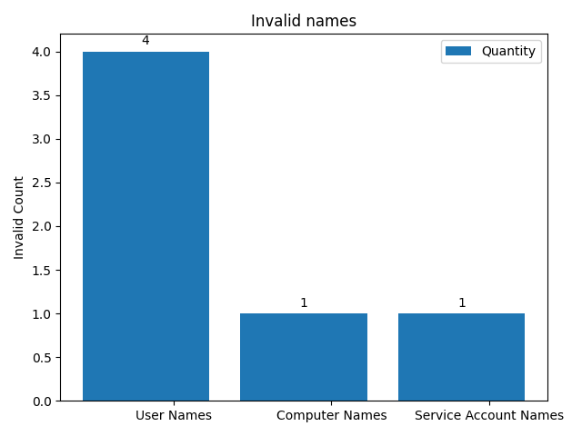

# Audit Report for KTG.local #

 ## Conducted By Christopher M Kyriacou on 2021-04-27 23:15:06 ##

## Unused Users: ##

|    | User                   |   Days Unused |
|---:|:-----------------------|--------------:|
|  0 | Administrator          |            48 |
|  1 | Christopher M Kyriacou |             2 |
## Unused User Count: 2 ##

## Unused Computers: ##

|    | Computer        |   Days Unused |
|---:|:----------------|--------------:|
|  0 | client-lap      |           103 |
|  1 | DESKTOP-A67G0P2 |           103 |
## Unused Computer Count: 2 ##

## Admin Report: ##
|    | Admin Group       | Members                                |
|---:|:------------------|:---------------------------------------|
|  0 | Domain Admins     | Christopher M Kyriacou,  Administrator |
|  1 | Enterprise Admins | Administrator                          |
|  2 | Key Admins        |                                        |
|  3 | Schema Admins     | Administrator                          |

## Administrator Last Logon ##

|    | Admin Name             | Last Logon          |   Days Since |
|---:|:-----------------------|:--------------------|-------------:|
|  0 | Christopher M Kyriacou | 2021-04-25 19:16:26 |           2  |
|  1 | Administrator          | 2021-03-10 13:51:20 |          48  |

## Service Accounts without manager set: ##

|    | Service Account   |
|---:|:------------------|
|  0 | Account Patcher   |
|  1 | Updates           |

## Distinguished Name Status: ##
|    | Computer        | DN Set   | DN                                              |
|---:|:----------------|:---------|:------------------------------------------------|
|  0 | client-lap      | Yes      | CN=client-lap,CN=Computers,DC=KTG,DC=local      |
|  1 | DESKTOP-A67G0P2 | Yes      | CN=DESKTOP-A67G0P2,CN=Computers,DC=KTG,DC=local |

## Users that need to change username: ##

|    | User                          | Username       |
|---:|:------------------------------|:---------------|
|  0 | Dave LinuxMan Fuller          | motordave      |
|  1 | Jamie Sutton                  | jamsut1        |
|  2 | Jason Borne                   | jasonbornobo   |
|  3 | Nathan SirDocumentation Chong | nathandocchong |
|  4 | Saffee Deputy Ghafoori        | sghafooie      |

## Service Accounts that need their names changed: ##
|    | Service Account   | Username          |
|---:|:------------------|:------------------|
|  0 | Account Patcher   | AccountPatcher317 |

## Computers that need their names changed: ##

No computers need their names changed.

## Users with passwords unchanged past the day limit: ##

|    | User                          | Username       |
|---:|:------------------------------|:---------------|
|  0 | Administrator                 | Administrator  |
|  1 | bobby bob                     | bbob           |
|  2 | Christopher M Kyriacou        | ckyriacou      |
|  3 | Dave LinuxMan Fuller          | motordave      |
|  4 | Guest                         | Guest          |
|  5 | Jamie Sutton                  | jamsut1        |
|  6 | Jason Borne                   | jasonbornobo   |
|  7 | krbtgt                        | krbtgt         |
|  8 | Nathan SirDocumentation Chong | nathandocchong |
|  9 | Saffee Deputy Ghafoori        | sghafooie      |

## Users with password's that don't expire: ##

|    | User                          | Username       |
|---:|:------------------------------|:---------------|
|  0 | bobby bob                     | bbob           |
|  1 | Christopher M Kyriacou        | ckyriacou      |
|  2 | Dave LinuxMan Fuller          | motordave      |
|  3 | Jamie Sutton                  | jamsut1        |
|  4 | Nathan SirDocumentation Chong | nathandocchong |
|  5 | Saffee Deputy Ghafoori        | sghafooie      |

