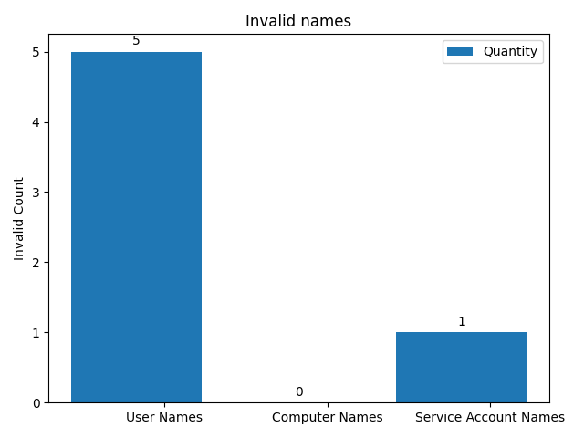

# Audit Report for KTG.local #

 ## Conducted By Christopher M Kyriacou on 2021-04-25 19:37:05 ##

## Unused Users: ##

|    | User          |   Days Unused |
|---:|:--------------|--------------:|
|  0 | Administrator |            46 |
## Unused User Count: 1 ##

## Unused Computers: ##

|    | Computer        |   Days Unused |
|---:|:----------------|--------------:|
|  0 | client-lap      |           100 |
|  1 | DESKTOP-A67G0P2 |           101 |
## Unused Computer Count: 2 ##

## Admin Report: ##
|    | Admin Group       | Members                                |
|---:|:------------------|:---------------------------------------|
|  0 | Domain Admins     | Christopher M Kyriacou,  Administrator |
|  1 | Enterprise Admins | Administrator                          |
|  2 | Key Admins        |                                        |
|  3 | Schema Admins     | Administrator                          |

## Administrator Last Logon ##

|    | Admin Name                 | Last Logon          |   Days Since |
|---:|:---------------------------|:--------------------|-------------:|
|  0 | ['Christopher M Kyriacou'] | 2021-04-25 19:16:26 |           0  |
|  1 | ['Administrator']          | 2021-03-10 13:51:20 |          46  |

## Service Accounts without manager set: ##

|    | Service Account   |
|---:|:------------------|
|  0 | Account Patcher   |
|  1 | Updates           |

## Distinguished Name Status: ##
|    | Computer        | DN Set   | DN                                              |
|---:|:----------------|:---------|:------------------------------------------------|
|  0 | client-lap      | Yes      | CN=client-lap,CN=Computers,DC=KTG,DC=local      |
|  1 | DESKTOP-A67G0P2 | Yes      | CN=DESKTOP-A67G0P2,CN=Computers,DC=KTG,DC=local |

## Users that need to change username: ##

No users need username correction.

## Service Accounts that need their names changed: ##
|    | Service Account   | Username          |
|---:|:------------------|:------------------|
|  0 | Account Patcher   | AccountPatcher317 |

## Computers that need their names changed: ##

No computers need their names changed.

## Users with passwords unchanged past the day limit: ##

|    | User                          | Username      |
|---:|:------------------------------|:--------------|
|  0 | Administrator                 | Administrator |
|  1 | bobby bob                     | bbob          |
|  2 | Christopher M Kyriacou        | ckyriacou     |
|  3 | Dave LinuxMan Fuller          | dfuller       |
|  4 | Guest                         | Guest         |
|  5 | Jamie Sutton                  | jsutton       |
|  6 | Jason Borne                   | jborne        |
|  7 | krbtgt                        | krbtgt        |
|  8 | Nathan SirDocumentation Chong | nchong        |
|  9 | Saffee Deputy Ghafoori        | sghafoori     |

## Users with password's that don't expire: ##

|    | User                          | Username   |
|---:|:------------------------------|:-----------|
|  0 | bobby bob                     | bbob       |
|  1 | Christopher M Kyriacou        | ckyriacou  |
|  2 | Dave LinuxMan Fuller          | dfuller    |
|  3 | Jamie Sutton                  | jsutton    |
|  4 | Nathan SirDocumentation Chong | nchong     |
|  5 | Saffee Deputy Ghafoori        | sghafoori  |

