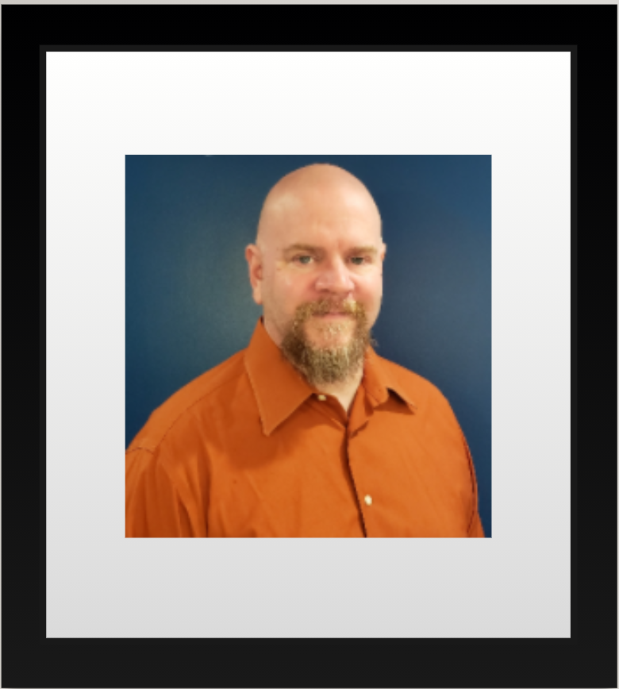

# Dave Fuller #
## Researcher ##

### Air Force Veteran with four years of military IT experience, certifications in Linux, Network+ and Security+. Associate degree in Computer Science from NOVA CC, majoring in Information Technology with a concentration in security. ###

### Experienced with mainframes, servers running varied operating systems and applications. Dave began his career in the US Air Force as a mainframe computer systems operator and security technician in Germany. He transitioned back to civilian life and spent the next few years working in the Richmond Virginia data center for GE Capital, which became Genworth. He obtained his Linux certification and as a result held a position as a Linux system operator for the U.S. subsidiary of the French Space Agency – CLS *(Collecte Localisation Satellites).* CLS America tracks ship, wildlife, and sensor buoys using satellites and transponders networked to Linux servers. While looking for a new challenge, Dave enrolled at Northern Virginia Community College where he received an Associates Degree in Computer Science. For the next few years Dave worked on his Bachelor's degree in Information Technology. With his newly minted degree, Dave is looking forward to his new career in cyber security and Linux enterprise solutions.  ###